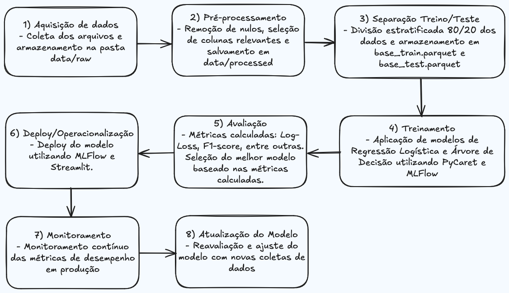

# Kobe Bryant Shot Prediction - Framework TDSP

## Projeto de Engenharia de Machine Learning - Previsão de Acertos do Kobe Bryant

### Objetivo

Desenvolver um preditor de arremessos de Kobe Bryant usando duas abordagens: Regressão e Classificação. O projeto deve prever se Kobe Bryant acertou ou errou um arremesso, utilizando o Framework TDSP (Team Data Science Process).

---

## Como executar o projeto

### Criar ambiente Conda e instalar dependências:
Com YAML 
```bash
conda env create -f environment.yml
```

### Executar o pipeline completo do plrojeto:
```bash
python code/pipeline.py
```

### Exibir o dashboard:
```bash
streamlit run outuputs/dashboards/streamlit_app.py
```

### Abrir o MLflow:
```bash
mlflow ui
```
Acessar: [http://localhost:5000](http://localhost:5000)


## Principais tecnologias utilizadas no projeto 
- Python 3.10
- Pycaret 3.0.0
- Seaborn 0.13.2
- Pandas 2.2.3
- Scikit-Learn 1.5.1
- MLflow 2.21.2
- Streamlit 1.43.2
- NumPy 2.1.3
- Matplotlib 3.9.2

## Métricas Finais (Produção)

| **Métrica**           | **Valor**               |
|-----------------------|------------------------|
| Modelo Escolhido      | Árvore de Decisão       |
| Log Loss (Produção)   | 0.5698                  |
| F1-Score (Produção)   | 0.5324                  |

> O modelo de **Árvore de Decisão** foi selecionado para produção por apresentar melhor desempenho geral em métricas críticas como `F1-Score` e `Log Loss` em comparação à Regressão Logística. Além disso, a **Árvore de Decisão** oferece maior interpretabilidade e melhor desempenho na base de produção.  
>
> Embora o `Log Loss` não seja perfeito, o modelo apresentou um desempenho consistente em dados fora da amostra, sugerindo que está bem ajustado para o problema.


## Estrutura do Projeto

O projeto segue a estrutura proposta pelo TDSP:

```
📁 kobe_shot_prediction_tdsp/
├── code/
│   ├── preparacao_dados.py
│   ├── treinamento.py
│   ├── aplicacao.py
│   ├── pipeline.py
├── data/
│   ├── raw/
│   │   ├── dataset_kobe_dev.parquet
│   │   └── dataset_kobe_prod.parquet
│   ├── processed/
│       ├── data_filtered.parquet
│       ├── base_train.parquet
│       └── base_test.parquet
├── docs/
│   ├── diagramas/
│   ├── relatorios/
├── outputs/
│   └── dashboards/
│       └── streamlit_app.py
├── README.md
├── requirements.txt
└── environment.yml
```

---

## 2. Diagrama do Pipeline

O pipeline de desenvolvimento detalhado segue o seguinte fluxo:

1. **Aquisição de Dados**
   - Coleta dos arquivos e armazenamento na pasta `data/raw`.

2. **Pré-processamento**
   - Remoção de nulos, seleção de colunas relevantes e salvamento em `data/processed`.

3. **Separação Treino/Teste**
   - Divisão estratificada 80/20 dos dados e armazenamento em `base_train.parquet` e `base_test.parquet`.

4. **Treinamento**
   - Aplicação de modelos de Regressão Logística e Árvore de Decisão utilizando PyCaret e MLFlow.

5. **Avaliação**
   - Métricas calculadas: Log-Loss, F1-score, entre outras.
   - Seleção do melhor modelo baseado nas métricas calculadas.

6. **Deploy/Operacionalização**
   - Deploy do modelo utilizando MLFlow, API Flask ou Streamlit.

7. **Monitoramento**
   - Monitoramento contínuo das métricas de desempenho em produção.

8. **Atualização do Modelo**
   - Reavaliação e ajuste do modelo com novas coletas de dados.

### Diagrama Visual do Pipeline



---

## 3. Funções das Ferramentas

### 🔨 PyCaret
- Facilita o treinamento e a comparação de modelos através de funções simplificadas.
- Permite testar múltiplos algoritmos de classificação e regressão.

### 🔨 Scikit-Learn
- Fornece algoritmos de machine learning essenciais para o projeto.
- É utilizado em conjunto com o PyCaret para o treinamento dos modelos.

### 🔨 MLFlow
- Usado para rastrear experimentos e registrar métricas.
- Facilita o deploy do modelo final.
- Permite monitorar o desempenho do modelo.

### 🔨 Streamlit
- Permite a criação de dashboards interativos para visualização dos resultados.
- Facilita o monitoramento do desempenho do modelo.

---

## 4. Artefatos Criados

- `data_filtered.parquet`: Conjunto de dados limpo e filtrado.
- `base_train.parquet`: Dados de treino (80%).
- `base_test.parquet`: Dados de teste (20%).
- `final_model.pkl`: Modelo treinado e registrado no MLFlow.
- **Dashboard Streamlit**: Visualização dos resultados.

---

## 5. Pipeline de Processamento de Dados

A pipeline de processamento de dados inclui as seguintes etapas:
- Carregamento e limpeza dos dados.
- Seleção das colunas especificadas (`lat`, `lon`, `minutes_remaining`, `period`, `playoffs`, `shot_distance`, `shot_made_flag`).
- Remoção de linhas com valores ausentes.
- Separação dos dados em treino e teste (80% e 20%).
- Registro de métricas no MLFlow.

---

## 6. Pipeline de Treinamento

O treinamento dos modelos é realizado utilizando PyCaret, com duas abordagens principais:
- Regressão Logística.
- Árvore de Decisão.

Os modelos são avaliados utilizando métricas de `Log Loss` e `F1_Score` e o melhor é escolhido com base nessas métricas.

---

## 7. Pipeline de Aplicação

A aplicação do modelo é feita através do script `aplicacao.py`, que:
- Carrega o modelo final registrado no MLFlow.
- Realiza previsões na base de produção (`dataset_kobe_prod.parquet`).
- Registra os resultados e métricas no MLFlow.

---

## 8. Dashboard Streamlit

Um dashboard interativo foi implementado usando Streamlit para monitorar o desempenho do modelo.

```bash
streamlit run outputs/dashboards/streamlit_app.py
```

---

## 9. Repositório Git

O projeto está disponível no repositório GitHub: [Link do Repositório](#)

---

## 10. Conclusão

O projeto foi desenvolvido com sucesso utilizando as ferramentas indicadas (PyCaret, Scikit-Learn, MLFlow e Streamlit). O pipeline completo foi implementado e o modelo final foi registrado e monitorado adequadamente.

---
