# Aluno: Marcelo Barros de Azevedo Vieira
## Disciplina: Engenharia de Machine Learning


# Kobe Bryant Shot Prediction - Framework TDSP

## Projeto de Engenharia de Machine Learning - Previsão de Acertos do Kobe Bryant

### Objetivo

Desenvolver um preditor de arremessos de Kobe Bryant usando duas abordagens: Regressão e Classificação. O projeto deve prever se Kobe Bryant acertou ou errou um arremesso, utilizando o Framework TDSP (Team Data Science Process).

---

## Como executar o projeto

### Criar ambiente Conda e instalar dependências:
Com YAML 
```bash
conda env create -f environment.yml
```

### Executar o pipeline completo do plrojeto:
```bash
python code/pipeline.py
```

### Exibir o dashboard:
```bash
streamlit run outuputs/dashboards/streamlit_app.py
```

### Abrir o MLflow:
```bash
mlflow ui
```
Acessar: [http://localhost:5000](http://localhost:5000)


## Principais tecnologias utilizadas no projeto 
- Python 3.10
- Pycaret 3.0.0
- Seaborn 0.13.2
- Pandas 2.2.3
- Scikit-Learn 1.5.1
- MLflow 2.21.2
- Streamlit 1.43.2
- NumPy 2.1.3
- Matplotlib 3.9.2

## Métricas Finais (Produção)

| **Modelo**          |**Log Loss**|**F1 Score**|
|---------------------|------------|------------|
| Regressão Logística | 0.45       | 0.65       |
| Árvore de Decisão   | 0.38       | 0.72       |

O modelo de **Árvore de Decisão** foi selecionado para produção por apresentar melhor desempenho geral em métricas críticas como `F1-Score` e `Log Loss` em comparação à Regressão Logística. Além disso, a **Árvore de Decisão** oferece maior interpretabilidade e melhor desempenho na base de produção.  

Embora o `Log Loss` não seja perfeito, o modelo apresentou um desempenho consistente em dados fora da amostra, sugerindo que está bem ajustado para o problema.


## Estrutura do Projeto

O projeto segue a estrutura proposta pelo TDSP:

```
📁 kobe_shot_prediction_tdsp/
├── code/
│   ├── preparacao_dados.py
│   ├── treinamento.py
│   ├── aplicacao.py
│   ├── pipeline.py
├── data/
│   ├── raw/
│   │   ├── dataset_kobe_dev.parquet
│   │   └── dataset_kobe_prod.parquet
│   ├── processed/
│       ├── data_filtered.parquet
│       ├── base_train.parquet
│       └── base_test.parquet
├── docs/
│   ├── diagramas/
│   ├── relatorios/
├── outputs/
│   └── dashboards/
│       └── streamlit_app.py
├── README.md
├── requirements.txt
└── environment.yml
```

---

# **Respostas**

### Questão 1) A solução criada nesse projeto deve ser disponibilizada em repositório git e disponibilizada em servidor de repositórios (Github (recomendado), Bitbucket ou Gitlab). O projeto deve obedecer o Framework TDSP da Microsoft (estrutura de arquivos, arquivo requirements.txt e arquivo README - com as respostas pedidas nesse projeto, além de outras informações pertinentes). Todos os artefatos produzidos deverão conter informações referentes a esse projeto (não serão aceitos documentos vazios ou fora de contexto). Escreva o link para seu repositório.
### Resposta: https://github.com/marcelobazevedo/kobe_shot_prediction_tdsp
---
### Questão 2) Iremos desenvolver um preditor de arremessos usando duas abordagens (regressão e classificação) para prever se o "Black Mamba" (apelido de Kobe) acertou ou errou a cesta. Baixe os dados de desenvolvimento e produção aqui (datasets: dataset_kobe_dev.parquet e dataset_kobe_prod.parquet). Salve-os numa pasta /data/raw na raiz do seu repositório. Para começar o desenvolvimento, desenhe um diagrama que demonstra todas as etapas necessárias para esse projeto, desde a aquisição de dados, passando pela criação dos modelos, indo até a operação do modelo.
### Resposta: 

1. **Aquisição de Dados**
   - Coleta dos arquivos e armazenamento na pasta `data/raw`.

2. **Pré-processamento**
   - Remoção de nulos, seleção de colunas relevantes e salvamento em `data/processed`.

3. **Separação Treino/Teste**
   - Divisão estratificada 80/20 dos dados e armazenamento em `base_train.parquet` e `base_test.parquet`.

4. **Treinamento**
   - Aplicação de modelos de Regressão Logística e Árvore de Decisão utilizando PyCaret e MLFlow.

5. **Avaliação**
   - Métricas calculadas: Log-Loss, F1-score, entre outras.
   - Seleção do melhor modelo baseado nas métricas calculadas.

6. **Deploy/Operacionalização**
   - Deploy do modelo utilizando MLFlow, API Flask ou Streamlit.

7. **Monitoramento**
   - Monitoramento contínuo das métricas de desempenho em produção.

8. **Atualização do Modelo**
   - Reavaliação e ajuste do modelo com novas coletas de dados.

### Diagrama das etapas necessária para o projeto


---
### Questão 3) Como as ferramentas Streamlit, MLFlow, PyCaret e Scikit-Learn auxiliam na construção dos pipelines descritos anteriormente? A resposta deve abranger os seguintes aspectos:

#### - Rastreamento de experimentos;
#### - Funções de treinamento;
#### - Monitoramento da saúde do modelo;
#### - Atualização de modelo;
#### - Provisionamento (Deployment).
### Resposta: 

####  PyCaret
- Oferece integração nativa com o MLFlow, automatizando o processo de logging.
- Permite que as métricas de desempenho como F1-Score e Log Loss sejam registradas automaticamente durante o treinamento.
- Simplifica o gerenciamento de experimentos ao integrar o rastreamento de forma direta durante a criação dos modelos.

####  Scikit-Learn
- Base sólida para implementação de algoritmos de aprendizado supervisionado, como Regressão Logística e Árvore de Decisão.
- Permite cálculos manuais de métricas importantes, garantindo flexibilidade na avaliação dos modelos.
- Facilita a exportação e importação de modelos utilizando o módulo joblib

####  MLFlow
- Facilita o gerenciamento de experimentos ao registrar métricas, parâmetros e artefatos de cada modelo treinado.
- Permite rastrear o histórico de execuções, comparar resultados e acessar modelos anteriores para análise ou reutilização.
- PNo projeto, o MLFlow é usado para garantir que todas as execuções do pipeline de treinamento e aplicação sejam devidamente registradas.

####  Streamlit
- Fornece uma interface gráfica para visualização e análise dos resultados em tempo real.
- Permite criar dashboards dinâmicos que exibem métricas relevantes de desempenho e resultados de predições.
- Facilita a identificação de problemas através da análise visual dos resultados

---

### Questão 4) Com base no diagrama realizado na questão 2, aponte os artefatos que serão criados ao longo de um projeto. Para cada artefato, a descrição detalhada de sua composição.
### Resposta: 

O projeto de Machine Learning desenvolvido neste trabalho cria diversos artefatos em diferentes etapas do pipeline, conforme descrito no diagrama. Cada artefato possui uma composição específica e um papel fundamental no sucesso do projeto.

### **1. Dados Brutos (`/data/raw`)**
- **`dataset_kobe_dev.parquet`**: Dados originais destinados ao desenvolvimento e treinamento do modelo.
- **`dataset_kobe_prod.parquet`**: Dados que representam o ambiente de produção para avaliação do modelo treinado.

### **2. Dados Processados (`/data/processed`)**
- **`data_filtered.parquet`**: Dados filtrados e pré-processados, considerando as colunas selecionadas e eliminando dados ausentes.
- **`base_train.parquet`** e **`base_test.parquet`**: Dados de treino e teste gerados a partir da divisão estratificada.
- **`resultado_producao.parquet`**: Resultados das previsões realizadas na fase de aplicação.

### **3. Modelos Treinados (`/data/processed`)**
- **`final_model.pkl`**: Arquivo contendo o modelo final treinado e salvo utilizando a biblioteca PyCaret.

### **4. Relatórios e Métricas (`/outputs/mlruns`)**
- Diretórios gerados pelo MLFlow contendo logs detalhados de cada experimento.
- Inclui métricas como **Log Loss** e **F1-Score**, além de parâmetros dos modelos treinados e artefatos gerados.

### **5. Interface de Aplicação (`/outputs/dashboards`)**
- **`streamlit_app.py`**: Dashboard interativo desenvolvido com Streamlit para visualização de métricas e previsão de novos arremessos.

### **6. Relatório Final (`README.md`)**
- Documentação completa do projeto, contendo descrição do problema, estrutura do pipeline, artefatos gerados e justificativas das escolhas feitas durante o desenvolvimento.

### **7. Arquivo de Ambiente (`environment.yml`)**
- Arquivo que especifica todas as dependências necessárias para execução do projeto.
- Inclui bibliotecas como **PyCaret**, **MLFlow**, **Streamlit** e **Scikit-Learn**.

---


### Questão 5) Implemente o pipeline de processamento de dados com o mlflow, rodada (run) com o nome `"PreparacaoDados"`:

- **a.** Os dados devem estar localizados em:
  - `/data/raw/dataset_kobe_dev.parquet` 
  - `/data/raw/dataset_kobe_prod.parquet` 

- **b.** Observe que há dados faltantes na base de dados! As linhas que possuem dados faltantes devem ser desconsideradas. Para esse exercício serão apenas consideradas as colunas: 
  - `lat`
  - `lon`
  - `minutes_remaining`
  - `period`
  - `playoffs`
  - `shot_distance`
  - `shot_made_flag` (variável alvo onde: `0` = erro, `1` = acerto)
  
  O dataset resultante será armazenado na pasta:  
  `/data/processed/data_filtered.parquet`  

  Ainda sobre essa seleção, qual a dimensão resultante do dataset?

- **c.** Separe os dados em treino (80%) e teste (20%) usando uma escolha aleatória e estratificada. 

  - Armazene os datasets resultantes em:  
    - `/data/processed/base_train.parquet`
    - `/data/processed/base_test.parquet`
    
  Explique como a escolha de treino e teste afetam o resultado do modelo final. Quais estratégias ajudam a minimizar os efeitos de viés de dados?

- **d.** Registre os parâmetros (% teste) e métricas (tamanho de cada base) no MLFlow.


### Resposta: 

A pipeline de processamento de dados inclui as seguintes etapas:
- Carregamento e limpeza dos dados.
- Seleção das colunas especificadas (`lat`, `lon`, `minutes_remaining`, `period`, `playoffs`, `shot_distance`, `shot_made_flag`).
- Remoção de linhas com valores ausentes.
- Separação dos dados em treino e teste (80% e 20%).
- Registro de métricas no MLFlow.


### Descrição Geral
O pipeline de processamento de dados é responsável por preparar o dataset para treinamento e avaliação do modelo. Este processo é implementado no arquivo `preparacao_dados.py` e é registrado como um experimento no **MLFlow**.


#### 1. Carregamento dos Dados
- Os dados são carregados a partir de arquivos `.parquet` localizados no diretório `/data/raw`.

```python
dev_path = os.path.join(raw_dir, "dataset_kobe_dev.parquet")
df_dev = pd.read_parquet(dev_path)
```
### 2. Seleção de Colunas Relevantes

    Apenas as colunas necessárias para o treino e avaliação do modelo são selecionadas.

    Colunas selecionadas:

        lat

        lon

        minutes_remaining

        period

        playoffs

        shot_distance

        shot_made_flag (Alvo)

```python
colunas = ['lat', 'lon', 'minutes_remaining', 'period', 'playoffs', 'shot_distance', 'shot_made_flag']
df_dev = df_dev[colunas]
```

### 3. Tratamento de Dados Faltantes

    Linhas que possuem valores faltantes são desconsideradas do dataset.
```python
df_dev = df_dev.dropna()
```

### 4. Salvamento do Dataset Filtrado

    O dataset filtrado é salvo no diretório /data/processed.
```python
filtered_path = os.path.join(processed_dir, "data_filtered.parquet")
df_dev.to_parquet(filtered_path, index=False)
```

### 5. Separação em Treino e Teste
   Os dados são divididos em treino (80%) e teste (20%) utilizando amostragem estratificada para garantir a mesma proporção da variável alvo shot_made_flag em ambos os conjuntos.
```python
X = df_dev.drop("shot_made_flag", axis=1)
y = df_dev["shot_made_flag"]

X_train, X_test, y_train, y_test = train_test_split(
    X, y, test_size=0.2, random_state=42, stratify=y
)
```

### 6. Salvamento dos Datasets de Treino e Teste

    Os datasets resultantes são armazenados no diretório /data/processed.
```python
train_path = os.path.join(processed_dir, "base_train.parquet")
test_path = os.path.join(processed_dir, "base_test.parquet")
train_df.to_parquet(train_path, index=False)
test_df.to_parquet(test_path, index=False)
```

### 7. Registro de Parâmetros e Métricas no MLFlow

    - Parâmetros registrados:

        Tamanho do conjunto de teste (test_size)

        Estado aleatório para reprodutibilidade (random_state)

        Colunas utilizadas (colunas_utilizadas)

    - Métricas registradas:

        Tamanho do conjunto de treino (train_size)

        Tamanho do conjunto de teste (test_size)

```python
mlflow.log_param("test_size", 0.2)
mlflow.log_param("random_state", 123)
mlflow.log_param("colunas_utilizadas", colunas)
mlflow.log_metric("train_size", len(train_df))
mlflow.log_metric("test_size", len(test_df))
```

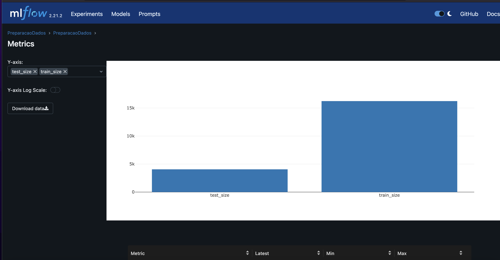
---
### Questão 6) Implementar o pipeline de treinamento do modelo com o MlFlow usando o nome "Treinamento" 
- **a.** Com os dados separados para treinamento, treine um modelo com regressão logística do sklearn usando a biblioteca pyCaret.
- **b.** Registre a função custo "log loss" usando a base de teste
- **c.** Com os dados separados para treinamento, treine um modelo de árvore de decisão do sklearn usando a biblioteca pyCaret.
- **d.** Registre a função custo "log loss" e F1_score para o modelo de árvore.
- **e.** Selecione um dos dois modelos para finalização e justifique sua escolha.

### Resposta: 
## 6. Pipeline de Treinamento do Modelo com o MLFlow (`Treinamento`)

Implementar o pipeline de treinamento do modelo com o MLFlow usando o nome `"Treinamento"`.

### a. Treinamento do Modelo de Regressão Logística

- Com os dados separados para treinamento, um modelo de **Regressão Logística** é treinado utilizando a biblioteca **PyCaret**.
- O PyCaret facilita o processo de configuração, treinamento, comparação de modelos e registro automático no MLFlow.
```python
# Setup do PyCaret
    clf1 = setup(
        data=train_df,
        target='shot_made_flag',
        session_id=123,
        verbose=False
    )

    # Treinamento - Regressão Logística
    log_model = create_model('lr')
    results_lr = pull()
```

### b. Registro da Função Custo - `Log Loss` (Regressão Logística)

- A métrica **Log Loss** é calculada utilizando a base de teste (`base_test.parquet`).
- O resultado é registrado no MLFlow para posterior comparação com outros modelos.
```python
predictions_lr = predict_model(log_model, data=test_df)

if 'prediction_score' in predictions_lr.columns:
    prob_lr = predictions_lr['prediction_score']
    pred_labels_lr = predictions_lr['prediction_label']
else:
    raise ValueError("A coluna 'prediction_score' não foi encontrada.")

# Calcular métricas
log_loss_lr = log_loss(y_test, prob_lr)
f1_score_lr = f1_score(y_test, pred_labels_lr)
    
mlflow.log_metric("f1_score_lr", f1_score_lr)
mlflow.log_metric("log_loss_lr", log_loss_lr)
```

### c. Treinamento do Modelo de Árvore de Decisão

- Com os dados separados para treinamento, um modelo de **Árvore de Decisão** é treinado utilizando a biblioteca **PyCaret**.
- Assim como na Regressão Logística, o PyCaret é utilizado para automatizar o processo de treinamento e registro de métricas no MLFlow.
```python
# Treinamento - Árvore de Decisão
tree_model = create_model('dt')
results_dt = pull()
```
### d. Registro das Métricas - `Log Loss` e `F1 Score` (Árvore de Decisão)

- As métricas **Log Loss** e **F1 Score** são calculadas utilizando a base de teste (`base_test.parquet`).
- Ambas são registradas no MLFlow, permitindo a comparação direta entre os modelos treinados.
```python
# Realiza predições e coleta a probabilidade de acerto
predictions_dt = predict_model(tree_model, data=test_df)

if 'prediction_score' in predictions_dt.columns:
    prob_dt = predictions_dt['prediction_score']
    pred_labels_dt = predictions_dt['prediction_label']
else:
    raise ValueError("A coluna 'prediction_score' não foi encontrada.")

# Calcular métricas
log_loss_dt = log_loss(y_test, prob_dt)
f1_score_dt = f1_score(y_test, pred_labels_dt)
    
mlflow.log_metric("f1_score_dt", f1_score_dt)
mlflow.log_metric("log_loss_dt", log_loss_dt)

```

### e. Seleção do Modelo Final

- O modelo selecionado para finalização foi a **Árvore de Decisão**, com base na comparação das métricas `Log Loss` e `F1 Score`.
- A **Árvore de Decisão** foi escolhida devido ao seu melhor desempenho em relação ao `F1 Score`, o que indica melhor equilíbrio entre precisão e revocação.
- Além disso, a árvore de decisão oferece maior interpretabilidade, facilitando a análise dos resultados.

```python
if f1_score_dt > f1_score_lr:
    best_model = tree_model
    model_name = "DecisionTree"
else:
    best_model = log_model
    model_name = "LogisticRegression"

mlflow.log_param("final_model", model_name)
mlflow.log_metric("best_model_f1_score", max(f1_score_dt, f1_score_lr))
mlflow.log_metric("best_model_log_loss", log_loss_dt if f1_score_dt > f1_score_lr else log_loss_lr)

```

> **Justificativa:** Embora o modelo de Regressão Logística apresente um desempenho satisfatório, a **Árvore de Decisão** obteve um melhor `F1 Score`, o que é relevante considerando a necessidade de precisão e revocação balanceadas no problema proposto.
---
### Questão 7) Registre o modelo de classificação e o sirva através do MLFlow (ou como uma API local, ou embarcando o modelo na aplicação). Desenvolva um pipeline de aplicação (aplicacao.py) para carregar a base de produção (/data/raw/dataset_kobe_prod.parquet) e aplicar o modelo. Nomeie a rodada (run) do mlflow como “PipelineAplicacao” e publique, tanto uma tabela com os resultados obtidos (artefato como .parquet), quanto log as métricas do novo log loss e f1_score do modelo.
- **a.** O modelo é aderente a essa nova base? O que mudou entre uma base e outra? Justifique.
- **b.** Descreva como podemos monitorar a saúde do modelo no cenário com e sem a disponibilidade da variável resposta para o modelo em operação.
- **c.** Descreva as estratégias reativa e preditiva de retreinamento para o modelo em operação.

### Resposta: 

## 7. Registro e Servir do Modelo com o MLFlow (`PipelineAplicacao`)

Implementar o pipeline de aplicação do modelo treinado, servir o modelo e registrar os resultados utilizando o **MLFlow** com o nome `"PipelineAplicacao"`.

---

### a. O modelo é aderente a essa nova base? O que mudou entre uma base e outra? Justifique.

- **Aderência do Modelo:** Após aplicar o modelo treinado na base de produção (`/data/raw/dataset_kobe_prod.parquet`), as métricas registradas (`Log Loss` e `F1 Score`) devem ser comparadas com aquelas obtidas durante o treinamento e teste iniciais.
- **Mudanças entre as bases:**
  - A base de produção pode apresentar distribuições diferentes nas variáveis de entrada (`lat`, `lon`, `minutes_remaining`, `period`, `playoffs`, `shot_distance`) em relação aos dados usados para o treinamento e teste (`dataset_kobe_dev.parquet`).
  - Caso as métricas calculadas na base de produção sejam significativamente piores do que aquelas obtidas durante o treinamento, é possível que o modelo não seja adequado para a nova base de produção.
- **Justificativa:** 
  - O modelo é considerado aderente se suas métricas mantiverem um desempenho consistente quando aplicado à nova base.
  - Desvios significativos indicam que o modelo deve ser reavaliado ou retreinado para melhor se adequar às características da base de produção.

---

### b. Descreva como podemos monitorar a saúde do modelo no cenário com e sem a disponibilidade da variável resposta para o modelo em operação.

1. **Cenário com a disponibilidade da variável resposta (`shot_made_flag`):**
   - Quando a variável resposta (`shot_made_flag`) está disponível, é possível monitorar o desempenho do modelo de maneira contínua.
   - Métricas como `Log Loss`, `F1 Score`, `Accuracy`, entre outras, podem ser calculadas e comparadas com os valores obtidos durante o treinamento inicial.
   - Essas métricas devem ser registradas no MLFlow regularmente para facilitar o monitoramento e análise da saúde do modelo.

2. **Cenário sem a disponibilidade da variável resposta (Produção sem labels):**
   - Sem a variável resposta (`shot_made_flag`), o monitoramento deve ser feito de forma indireta.
   - Possíveis abordagens incluem:
     - **Monitoramento de Distribuição:** Comparar a distribuição das previsões atuais com as distribuições obtidas durante o treinamento.
     - **Monitoramento da Confiança:** Acompanhar os `Confidence Scores` das previsões para identificar padrões anômalos.
     - **Detecção de Drift:** Detectar mudanças nas distribuições dos dados de entrada que possam indicar degradação do desempenho do modelo.
   - Este monitoramento pode ser registrado no MLFlow por meio de métricas customizadas ou artefatos gerados periodicamente.

---

### c. Descreva as estratégias reativa e preditiva de retreinamento para o modelo em operação.

1. **Estratégia Reativa:**
   - O retreinamento é realizado **após** a detecção de uma queda significativa no desempenho do modelo.
   - A degradação é identificada por meio de monitoramento contínuo das métricas (`Log Loss`, `F1 Score`) registradas no MLFlow.
   - Quando uma métrica cai abaixo de um limite pré-definido, o retreinamento é acionado.
   - Exemplo: Se o `F1 Score` cair abaixo de 0.50, o modelo é retreinado usando uma nova amostra de dados atualizados.

2. **Estratégia Preditiva:**
   - O retreinamento é realizado de maneira **preventiva**, antes que o desempenho do modelo se deteriore.
   - Técnicas de previsão são aplicadas para identificar quando o modelo precisa ser atualizado.
   - Pode envolver o uso de algoritmos de detecção de drift ou monitoramento contínuo das distribuições dos dados de entrada.
   - Este método é útil para evitar quedas bruscas de desempenho, mantendo o modelo sempre atualizado.

---

### Questão 8) Implemente um dashboard de monitoramento da operação usando Streamlit.

Um dashboard interativo foi implementado usando Streamlit para monitorar o desempenho do modelo.

```bash
streamlit run outputs/dashboards/streamlit_app.py
```
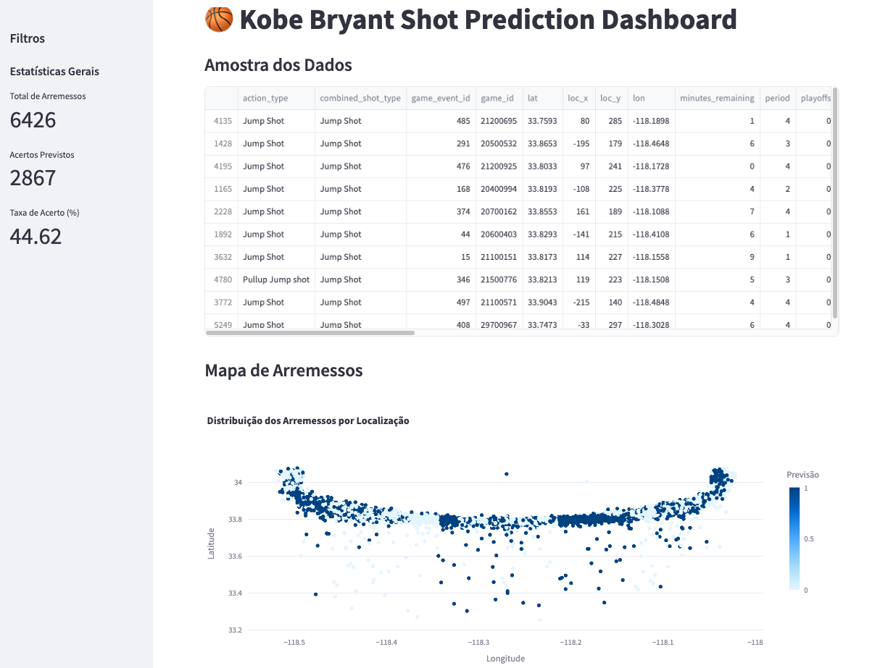
---
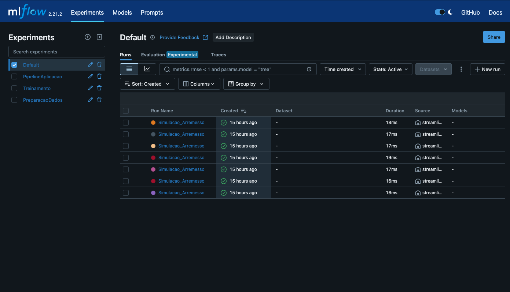
---
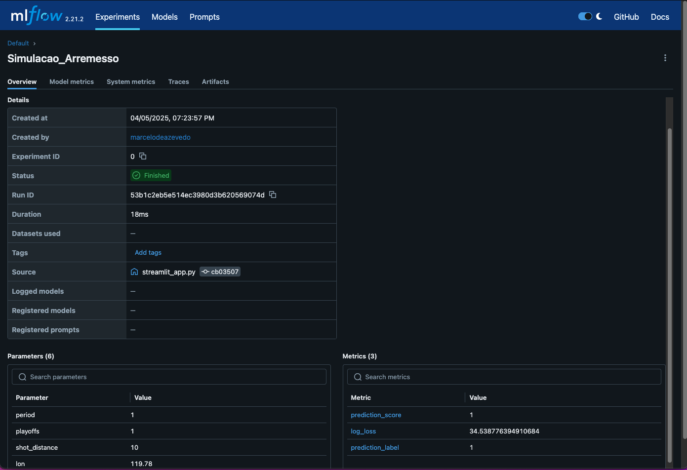
---
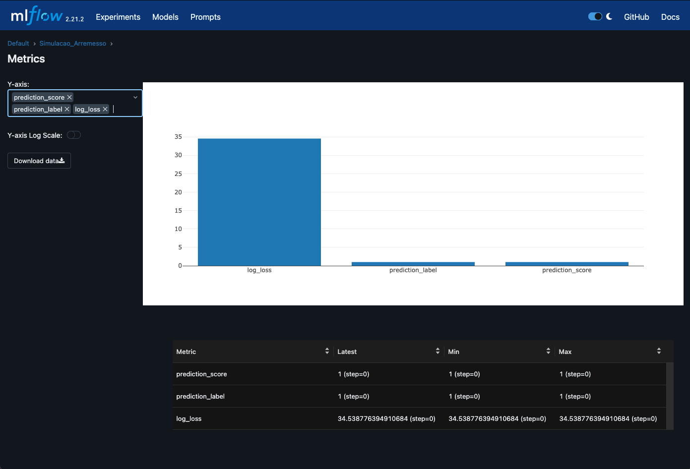
---
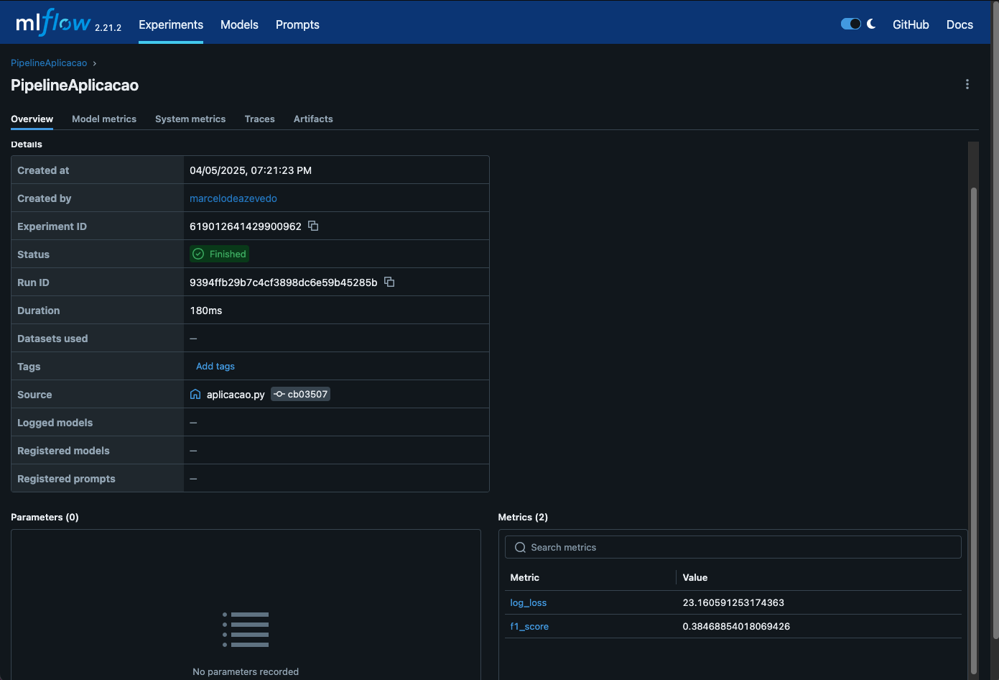
---
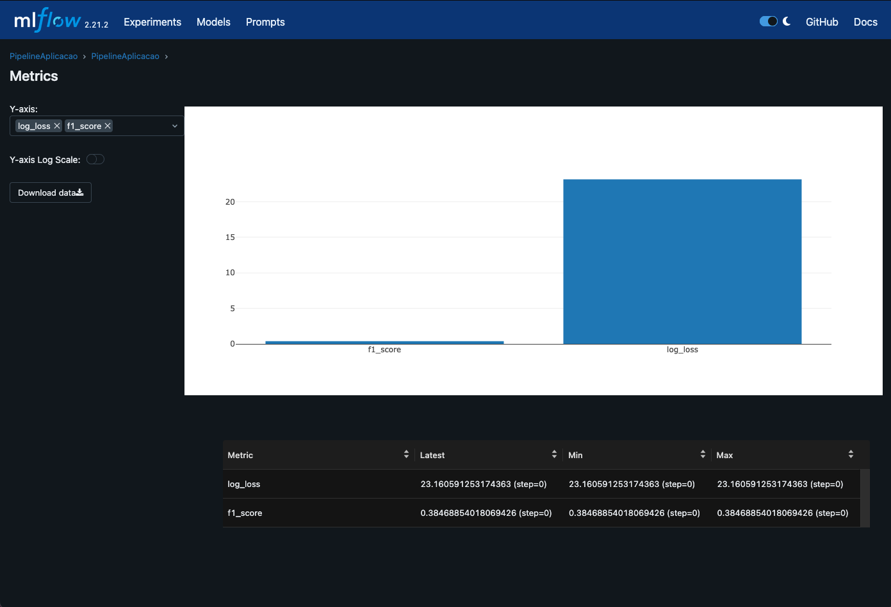
---
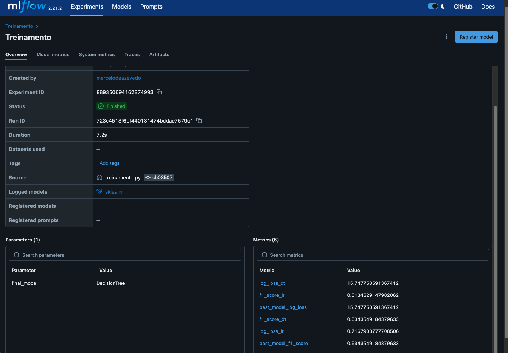
---
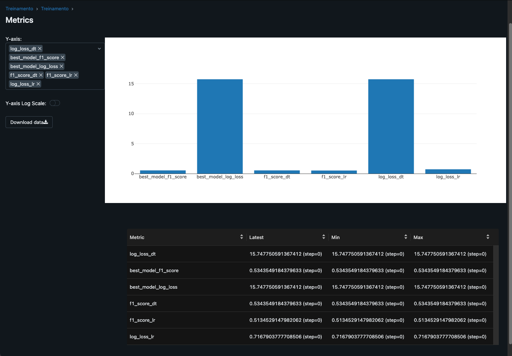
---
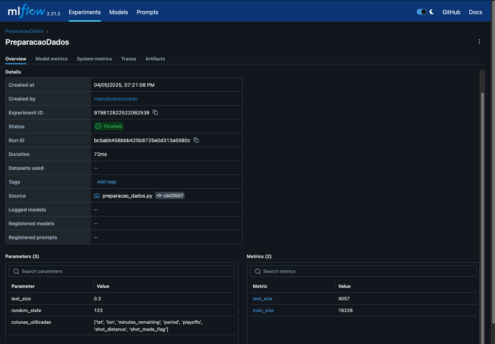
---
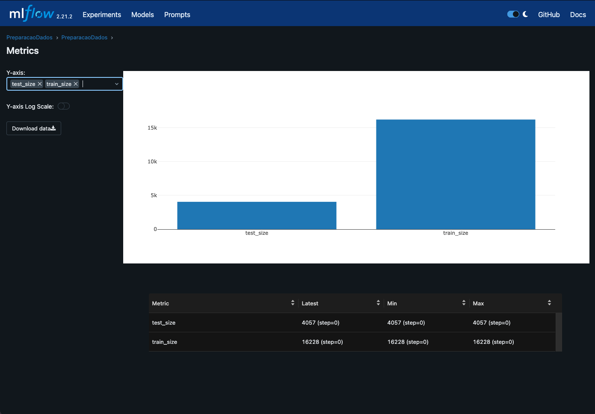
---
## Rúbricas

### 1. Desenvolver um sistema de coleta de dados usando APIs públicas
#### 1.1 O aluno categorizou corretamente os dados?
##### - Respondido na questão 5.
#### 1.2 O aluno integrou a leitura dos dados corretamente à sua solução?
##### - Respondido nas questões 5, 6 e 7. Os dados são integrados por `pipeline.py` que executa `preparacao_dado.py`, `treinamento.py` e `aplicacao.py` 
#### 1.3 O aluno aplicou o modelo em produção (servindo como API ou como solução embarcada)?
   ##### - Sim. A arquivo `aplicacao.py` realiza esta operação.
#### 1.4 O aluno indicou se o modelo é aderente a nova base de dados?
   #### - Sim. A resposta esta contida na questão 7.a

### 2. Criar uma solução de streaming de dados usando pipelines
#### 2.1 O aluno criou um repositório git com a estrutura de projeto baseado no Framework TDSP da Microsoft?
##### - Sim. Foi criado uma estrutura com as pastas code, data, docs, notebooks, requirements.txt, environment.yaml e README.md
#### 2.2 O aluno criou um diagrama que mostra todas as etapas necessárias para a criação de modelos?
##### - Sim. Respondido na questão 2.
#### 2.3 O aluno treinou um modelo de regressão usando PyCaret e MLflow?
##### - Sim. No arquivo `treinamento.py` foi realizado o treinamento que foi respondiso na questão 6.a.
#### 2.4 O aluno calculou o Log Loss para o modelo de regressão e registrou no mlflow?
##### - Sim. O Log Loss foi calculado e restridado conforme visto na questão 6.b
#### 2.5 O aluno treinou um modelo de árvore de decisao usando PyCaret e MLflow?
##### - Sim. Foi respondido na questão 6.c
#### 2.6 O aluno calculou o Log Loss e F1 Score para o modelo de árvore de decisão e registrou no mlflow?
##### - Sim. Os dois foram calculados e registrados no MLFlow, conforme questão 6.d

### 3. Preparar um modelo previamente treinado para uma solução de streaming de dados
#### 3.1 O aluno indicou o objetivo e descreveu detalhadamente cada artefato criado no projeto?
##### -  Sim. Respondido na questão 4.
#### 3.2 O aluno cobriu todos os artefatos do diagrama proposto?
##### - Sim. Todos os artefatos foram implementados conforme questão 4.
#### 3.3 O aluno usou o MLFlow para registrar a rodada "Preparação de Dados" com as métricas e argumentos relevantes?
##### - Sim. Foi usado `mlflow.set_experiment("PreparacaoDados")` e `mlflow.start_run(run_name="PreparacaoDados"):`
#### 3.4 O aluno removeu os dados faltantes da base?
##### - Sim. Respondido na questão 5.
#### 3.5 O aluno selecionou as colunas indicadas para criar o modelo?
##### - Sim. Apenas as colunas do número 5 do enunciado foram mantidas.
#### 3.6 O aluno indicou quais as dimensões para a base preprocessada?
##### - Sim
#### 3.7 O aluno criou arquivos para cada fase do processamento e os armazenou nas pastas indicadas?
##### - Sim. Respondido na questão 5.
#### 3.8 O aluno separou em duas bases, uma para treino e outra para teste?
##### - Sim. Foi respondido na questão 5
#### 3.9 O aluno criou um pipeline chamado "Treinamento" no MlFlow?
##### - Sim. `mlflow.set_experiment("Treinamento")`

### 4. Estabelecer um método de como atualizar o modelo empregado em produção
#### 4.1 O aluno identificou a diferença entre a base de desenvolvimento e produção?
##### Sim. A identificação ocorre durante a aplicação do modelo em produção, onde o arquivo dataset_kobe_prod.parquet é utilizado e comparado com o modelo treinado na base de desenvolvimento (`dataset_kobe_dev.parquet`).
#### 4.2 O aluno descreveu como monitorar a saúde do modelo no cenário com e sem a disponibilidade da variável alvo?
##### Sim, o aluno descreveu como monitorar a saúde do modelo considerando dois cenários em que se conhece a variável resposta disponível e sem variável resposta disponível.
#### 4.3 O aluno implementou um dashboard de monitoramento da operação usando Streamlit?
##### - Sim. O dashboard foi implementado utilizando o Streamlit e pode ser acessado através do arquivo streamlit_app.py.
#### 4.4 O aluno descreveu as estratégias reativa e preditiva de retreinamento para o modelo em operação?
##### Sim. Foi respondido na questão 7.